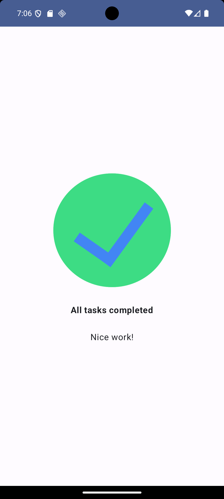

# 📋 Task Manager – Jetpack Compose Codelab

Este é o repositório do **Codelab Oficial do Google** que implementa um **Task Manager** usando **Jetpack Compose**, demonstrando como organizar tarefas com UI moderna no Android.

---

## 📸 Exemplo do App

> Aqui vai uma captura de tela do app em execução:




---

## 📌 Sobre o Projeto

Esse Codelab foi criado pelo Google para ensinar os principais conceitos do **Jetpack Compose** aplicados à construção de um app de de tarefas.


---

## 🚀 Pré-requisitos

Antes de rodar o projeto localmente, você precisa ter instalado:

✔️ **Android Studio Flamingo | Electric Eel ou superior**  
✔️ **SDK Android atual**  
✔️ **Kotlin Plugin habilitado**  
✔️ **JDK 11 (recomendado e compatível com Android Studio)**  
✔️ **Emulador Android configurado ou dispositivo físico com depuração USB**

> O Compose recebe atualizações frequentes — manter o Android Studio atualizado garante compatibilidade futura.

---

## 🛠 Como Rodar o Projeto

### 1. Clone o repositório

Abra um terminal e execute:

```bash
git clone https://github.com/sinngjpeg/google-codelab-task-manager.git
cd google-codelab-task-manager
```

2. Abra no Android Studio

1. Inicie o Android Studio.
2. Selecione Open an existing project.
3. Aponte para a pasta do projeto que você acabou de clonar.

Android Studio irá detectar o Gradle e baixar todas as dependências automaticamente.

### 3. Sincronize o Gradle
Quando o projeto for aberto:
- Aguarde o Gradle Sync completar
- Se necessário, aceite o download de componentes adicionais (SDK/NDK)

Esses passos garantem que o projeto sempre compile, independente do tempo que tenha passado.

### 4. Configure o Dispositivo

Escolha um destino para rodar o app:

- ✔️ Um emulador Android configurado pelo AVD
- ✔️ Um dispositivo físico com Depuração USB ativada

### 5. Execute o App

No Android Studio:

- Clique no botão Run ▶️
- Ou use o atalho Shift + F10

O app será instalado e iniciado no dispositivo/emulador selecionado.

```
.
├── app/                       # Módulo principal com o código do app
│   ├── src/main/java/…        # Códigos Kotlin
│   ├── src/main/res/…         # Recursos de layout, string e imagem
│   └── build.gradle.kts       # Configurações de build do app
├── build.gradle.kts           # Gradle de nível raíz
├── gradle/                    # Scripts e wrappers Gradle
├── settings.gradle.kts
└── README.md
```


[codelab task manager](https://developer.android.com/codelabs/basic-android-kotlin-compose-composables-practice-problems?authuser=1&hl=pt-br&continue=https%3A%2F%2Fdeveloper.android.com%2Fcourses%2Fpathways%2Fandroid-basics-compose-unit-1-pathway-3%3Fauthuser%3D1%26hl%3Dpt-br%23codelab-https%3A%2F%2Fdeveloper.android.com%2Fcodelabs%2Fbasic-android-kotlin-compose-composables-practice-problems#2)